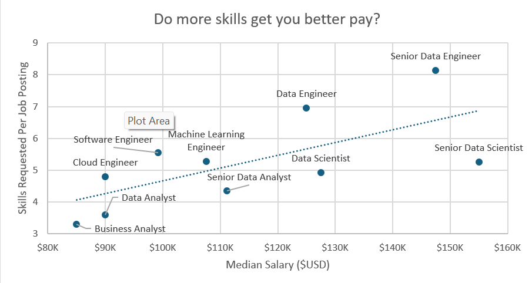
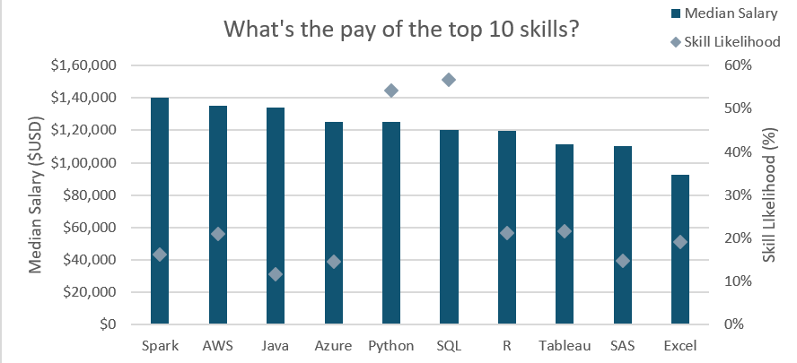

# Excel Data Analytics Project

### This project leverages Excel to analyze job market data for data-related roles, offering insights into key trends such as top skills, salary trends, and regional salary comparisons. By utilizing advanced Excel techniques, the project explores the following:

- Top skills needed for various data-related job titles.
- Salary analysis to understand trends in compensation based on job titles, skills, and regions.
- Regional comparisons of median salaries to help job seekers identify the best locations for specific roles.

Key Excel techniques like Pivot Tables, Power Pivot, and advanced Excel formulas were employed to extract actionable insights from the dataset. This project helps job seekers navigate the job market, equipping them with the knowledge to make informed decisions about their career paths.

# Skills I Used
## Excel
- I did all of the EDA, Visualizations, Aggregations, Methods, DAX and all the other activities necessary for the project all with the help of Excel
## Data Manipulation and Cleaning

I Organized and transformed raw job market data into structured formats.
Removed inconsistencies and duplicates to ensure data accuracy.

## Dashboard Design
I created interactive dashboards with slicers for dynamic filtering.
Used charts (e.g., bar, line and world map charts) to visualize salary and skill trends effectively.

## Data Analysis

Conducted exploratory data analysis (EDA) to uncover trends in salaries and skills demand.
Calculated and compared median salaries across regions and job titles.

## EDA 
- I conducted an in-depth exploration of the dataset to uncover critical insights relevant to job seekers in the data science industry, such as salary trends, high-demand skills, and job opportunities across regions.
- This project significantly enhanced my exploratory data analysis (EDA) skills, including identifying patterns, detecting anomalies, and deriving actionable insights from large datasets.
## Pivot Tables
- Pivot tables served as the backbone of this project, enabling efficient data summarization and analysis.
- They simplified aggregations, streamlined data grouping, and significantly reduced the complexity of analyzing large datasets.
- By using pivot tables, I was able to uncover key trends and patterns, making the data more actionable and insightful.
## Power Pivot
- Power Pivot was instrumental in automating many repetitive tasks that I used to perform manually as a beginner in Excel.
- It allowed me to create measures that enhanced the functionality of Pivot Tables and streamlined the data analysis process.
- I utilized Power Pivot to assign appropriate data types to columns, ensuring accuracy and consistency in calculations and visualizations.

## Salary Dashboard
- The Salary Dashboard, created using advanced Excel techniques, provides a comprehensive overview of top skills required for a specific job, filtered by location and work schedule.
- It displays the median salary for job titles under the selected conditions, offering valuable insights for job seekers.
- Most importantly, it highlights the ideal platforms for applying to jobs that meet specific criteria, simplifying the decision-making process.
- This dashboard was designed to assist job seekers in streamlining their job search and targeting roles that align with their preferences and skill set..

[Check It Out Here](Project_01-Dashboard)

## Salary Analysis
- In this part of the project, I conducted an in-depth analysis of the dataset to uncover relationships between skills and the salaries of job postings.
- Using advanced exploratory data analysis (EDA) techniques, I identified trends and patterns that provided actionable insights into how specific skills influence earning potential.
- This analysis was key to understanding which skills are most valuable in the job market and how they correlate with higher salaries.

[Check It Out Here](Project_02-Analysis)

### Do More Skills Mean More Pay?
- One of my primary objectives was to determine if having more skills translates to a higher salary.
- To achieve this, I utilized Power Query to break down the job_skills column into multiple rows, with each skill listed individually for every job title.
- I then used a Pivot Table to group the data by job titles and applied aggregate functions, such as the Median for the salary column, along with adding a Skills per Job column to calculate the number of skills listed per job.
- Finally, I created an insightful visualization using Pivot Charts, which allowed me to explore and present the relationship between the number of skills and salary trends.

###  What are the Top Skills for Data Nerds?
- In this section, I focused on identifying the top skills required for Data Science jobs.
- To do this, I first used Pivot Tables to group the data by skill, then added a Skill Count column to track the frequency of each skill across job listings.
- I filtered the data to display the Top 10 skills that appeared most frequently.
- Finally, I created a compelling Pivot Chart visualization that effectively showcases the most sought-after skills in the data science job market.

### The Pay for Top 10 Skills
- After identifying the Top 10 skills for Data Science jobs, I wanted to investigate how each of these skills correlates with salary levels.
- To do this, I created a Median Salary measure in Power Pivot and grouped the data by skills. I then added this measure to the Pivot Table to calculate the median salary for each skill.
- I also calculated the likelihood of a skill appearing in a job posting by dividing the number of times the skill appeared by the total number of job postings. I formatted this value as a percentage to make it more insightful.
- Finally, I visualized the findings using Pivot Charts, showing the salary distributions and the likelihood of each of the top skills appearing in job postings.

# What I learned

- Throughout this project, I gained a comprehensive understanding of the job market for Data Science roles, including the median salaries for various job titles and specific skills. I also assessed the likelihood of skills appearing in job postings and identified the most in-demand skills for roles such as Data Analysts, Data Engineers, and Data Scientists.

- By analyzing job postings and salary data, I was able to spot key trends and insights in the data job market. This gave me valuable insights into which skills and job titles are trending, which will be useful in shaping my career path and identifying skill gaps.

- I also honed my skills in Excel, specifically in Pivot Tables, Excel Formulas, and Power Pivot. These tools were crucial in enabling me to efficiently analyze and visualize the data, making the insights more accessible and actionable. This project has significantly improved my ability to work with complex datasets and use Excel for data analysis tasks.
# Insights

## Salary Trends:
- Highest-Paying Roles:
> Data-related roles like Data Scientist and Data Engineer offer the highest median salaries.

- Country Comparison:
> The US has the highest median salary for data jobs.

> Non-US salaries are, on average, 20-30% lower than their US counterparts.

- Skill Impact on Pay:

> Roles requiring SQL and Python skills command the highest salaries.

> Adding 1-2 additional specialized skills can increase pay by up to 15%.
##  Skill Analysis:
- Top Skills:

> The most in-demand skills for data-related jobs are SQL, Python, Tableau and R.

## Interactive Dashboard Insights:
- Users can dynamically filter insights based on job titles, countries, or skill sets.
> Example: When filtering for "Data Analyst" roles in the US, the median salary is $90,000 and the Top job platform to apply is Indeed and the total job count is 4,219.

> Example: Filtering for "Machine Learning Engineer" shows that the median salary is $1,50,000, which is way higher than data analysts and the job count is much low than that of data analysts.
## Skills vs Salary:
- Analyzing the average number of skills required shows:

> Jobs requiring more than 5 skills tend to pay more than those requiring fewer skills.

> However, few roles like data scientist pay high even with less than 5 skills.

# Conclusion

This project provided a comprehensive analysis of job market trends for data-related roles, leveraging advanced Excel techniques to extract meaningful insights. Through interactive dashboards and in-depth data exploration, key takeaways about salary trends, skill demands, and regional variations were uncovered.